## 操作环境：

- 电脑系统：Mac OS
- 手机：IOS-14.6/安卓-9
- Charles版本：v4.6.2

## 操作步骤

### 安装电脑端证书以及电脑端配置

1、打开`Charles`，选择`Help` => `SSL Proxying` => `Install Charles Root Certificate` ,安装完成后，会启动`钥匙串访问`

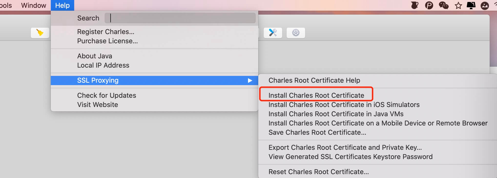

2、在`钥匙串访问`程序中，找到刚才的证书`Charles Proxy CA`

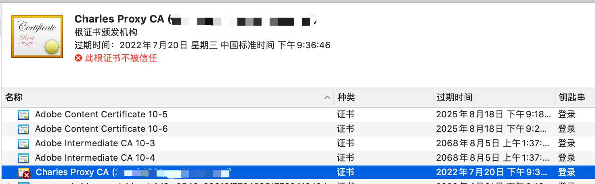

3、信任该证书

选中该证书，`右键` => `显示简介` =>  `信任` => 在`使用此证书时`选项中选择`始终信任`

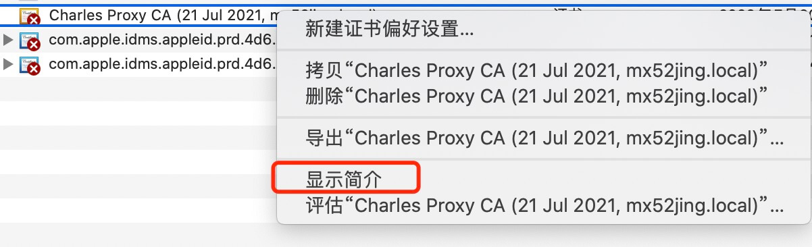

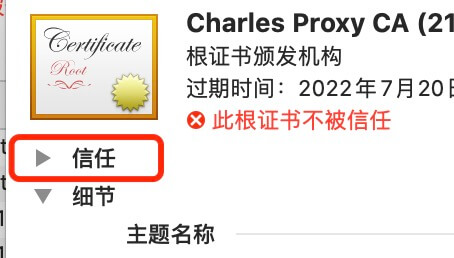

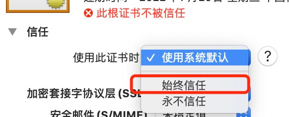

**上述操作完成后，关闭窗口，此时会提示输入`电脑密码`，按照提示输入即可**

4、将该证书复制并且粘贴到系统中，然后就能在系统中找到该证书，说明复制粘贴成功了，这时候电脑端就配置完毕了。

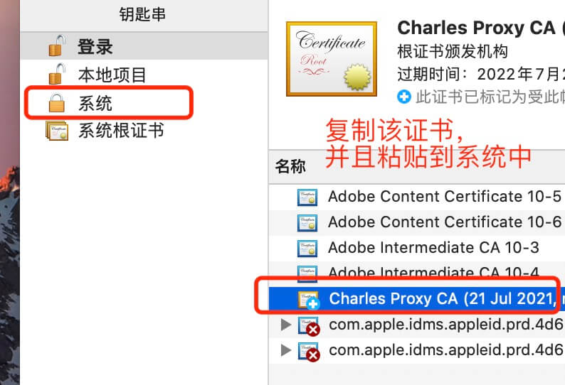

5、设置HTTPS端口抓包

点击 `Proxy` => `SSL Proxying Settings`，勾选`Enable SSL Proxying`，点击`Add`按钮

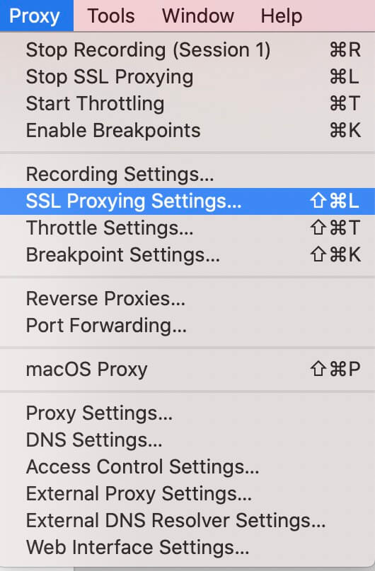 
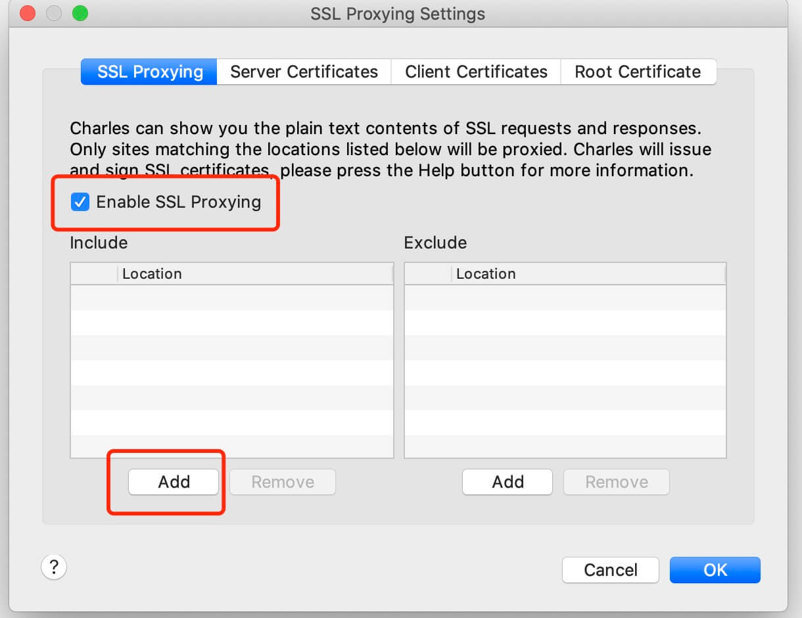
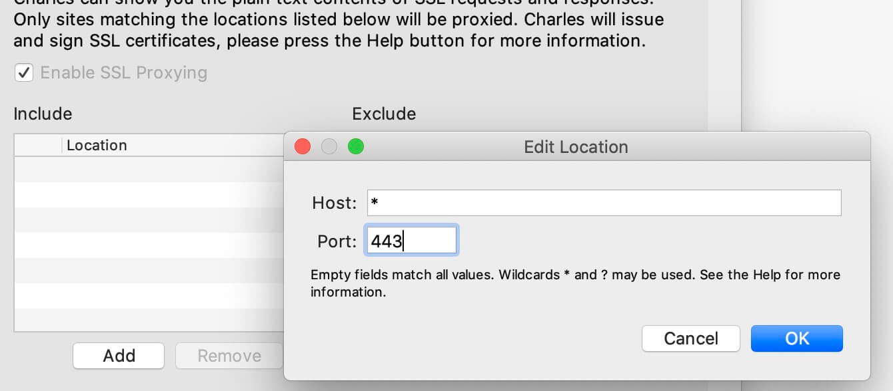

6、点击ok保存

### 安装手机端证书以及手机端配置

**注意⚠️：保证手机和电脑连接同一个WIFI**，**这很重要 这很重要 这很重要**

1、查看电脑IP

点击`Help` => `Local IP Address`

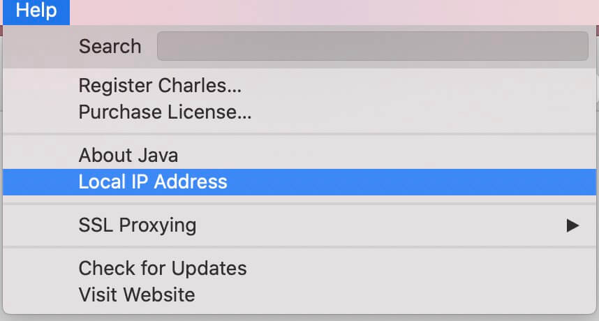
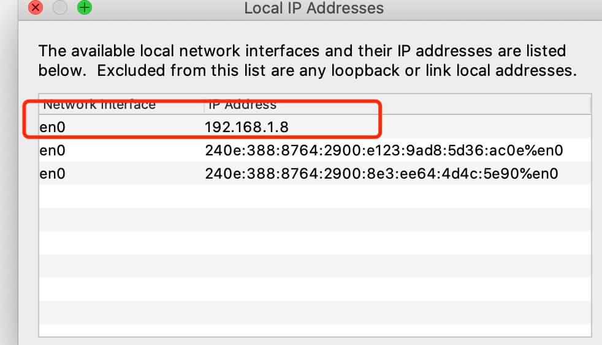

2、IOS手机

- 进入`设置` => `无线局域网`，找到当前手机链接的`wifi`，点击后面的圆圈进入查看`wifi`详情

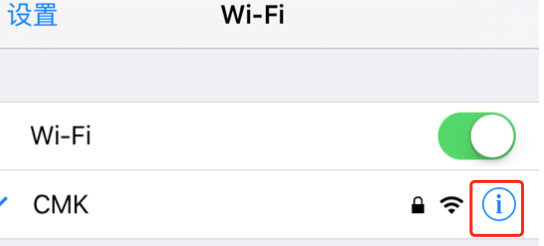

- 进入后，滑动到最底部，找到`HTTP代理`这一项，点击进去设置

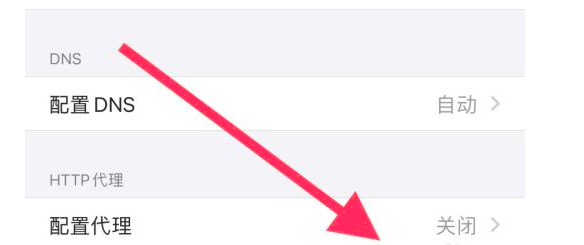

- 点击`手动`选项，设置`服务器`和`端口`，服务器IP就填写刚才`在电脑端Charles查到的IP`，端口填写`8888`，然后保存

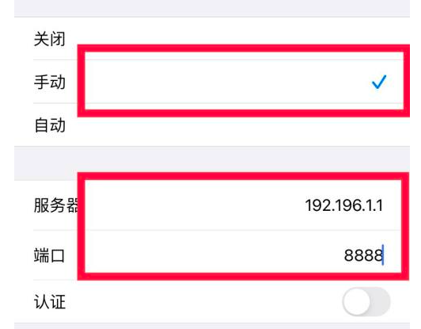

- 然后打开Safari浏览器，访问：`chls.pro/ssl`，此时电脑上会有连接提示，点击`allow`允许，然后在手机端下载证书

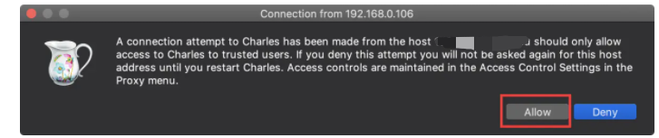

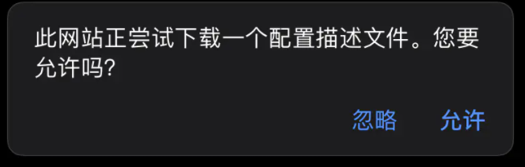

- 证书下载完成后，点击`设置` => `通用` => `描述文件`，安装刚才下载好的文件

- 安装完成后，点击`设置` => `通用` => `关于本机`，下拉到底部，点击`证书信任设置`，在`针对跟证书启用完全信任`中找到刚才的证书，并且打开信任开关

- 这样就配置完成

3、安卓机型

- 设置手机`wifi`代理和`IOS`的操作基本一样，设置完`wifi`代理后进行下一步

- 本人使用的`小米6`自带的浏览器是下载不下来证书的，最后下载了`Edge`浏览器，访问：`chls.pro/ssl`，此时电脑上会有连接提示，点击`allow`允许，然后在手机端下载证书并且安装

- 然后就可以使用了

