## 操作环境：

- 电脑系统：Mac OS
- 手机：IOS-14.6/安卓-9
- Charles版本：v4.6.2

## 操作步骤

### 安装电脑端证书以及电脑端配置

1、打开`Charles`，选择`Help` => `SSL Proxying` => `Install Charles Root Certificate` ,安装完成后，会启动`钥匙串访问`

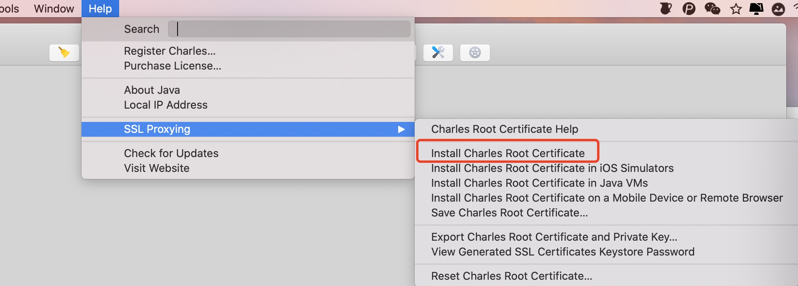

2、在`钥匙串访问`程序中，找到刚才的证书`Charles Proxy CA`

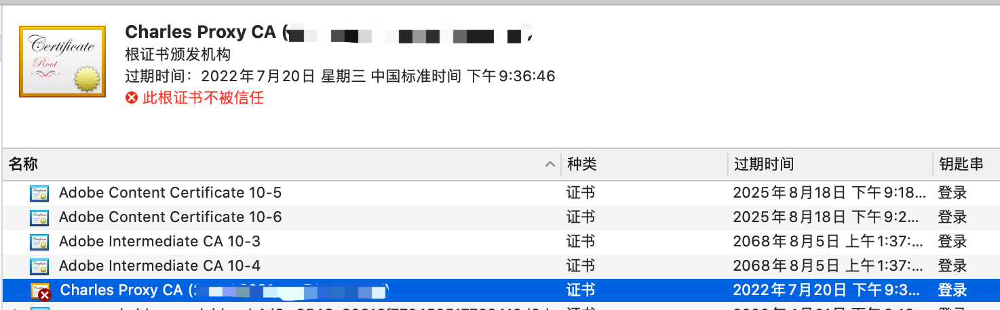

3、信任该证书

选中该证书，`右键` => `显示简介` =>  `信任` => 在`使用此证书时`选项中选择`始终信任`

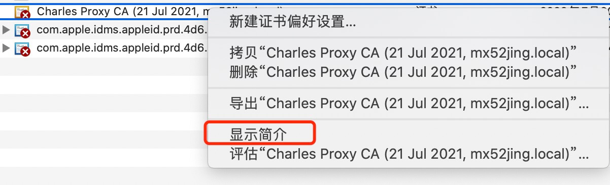

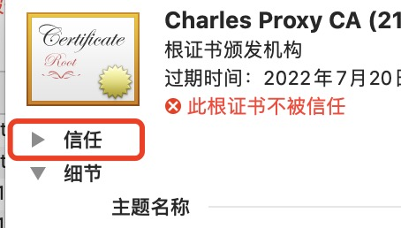

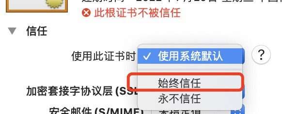

**上述操作完成后，关闭窗口，此时会提示输入`电脑密码`，按照提示输入即可**

4、将该证书复制并且粘贴到系统中，然后就能在系统中找到该证书，说明复制粘贴成功了，这时候电脑端就配置完毕了。

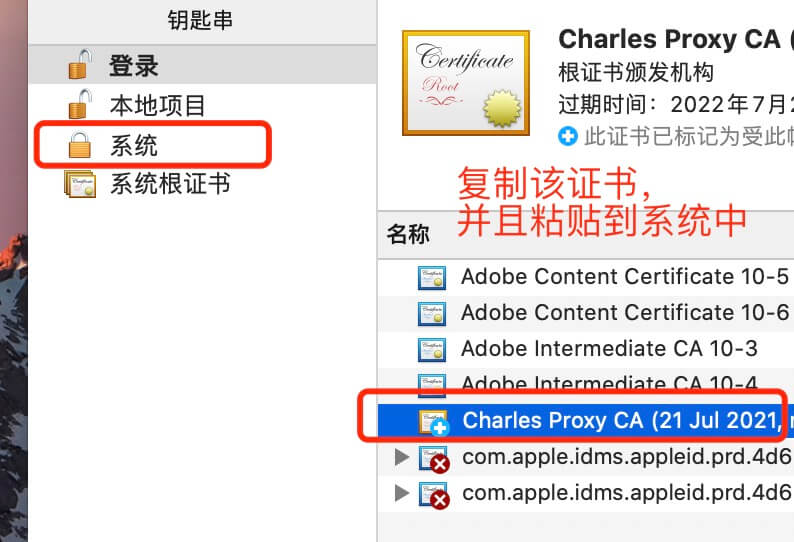

5、设置HTTPS端口抓包

点击 `Proxy` => `SSL Proxying Settings`，勾选`Enable SSL Proxying`，点击`Add`按钮

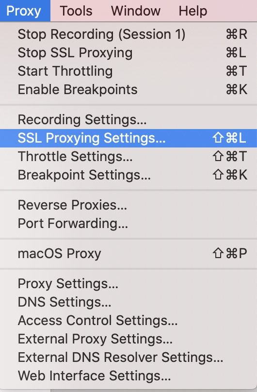 
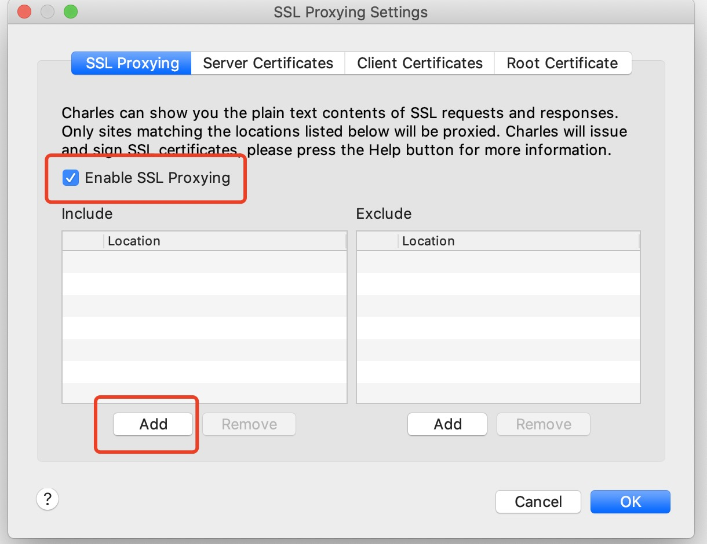
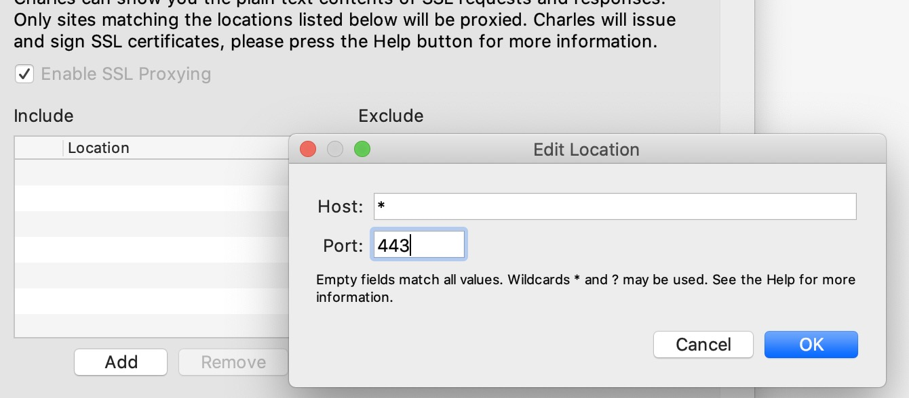

6、点击ok保存

### 安装手机端证书以及手机端配置

**注意⚠️：保证手机和电脑连接同一个WIFI**

1、查看电脑IP

点击`Help` => `Local IP Address`

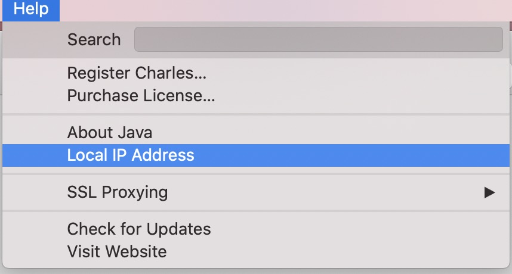
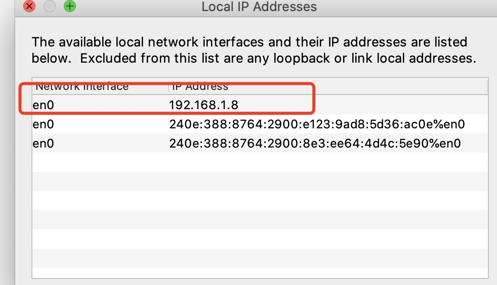
